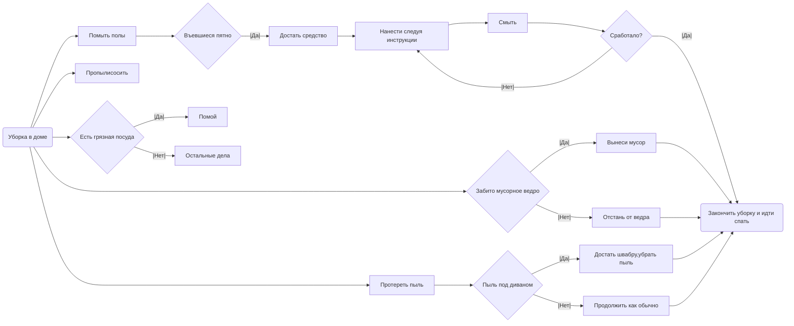
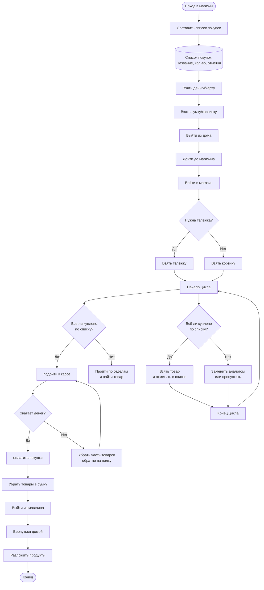
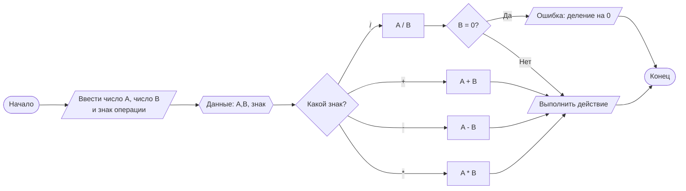
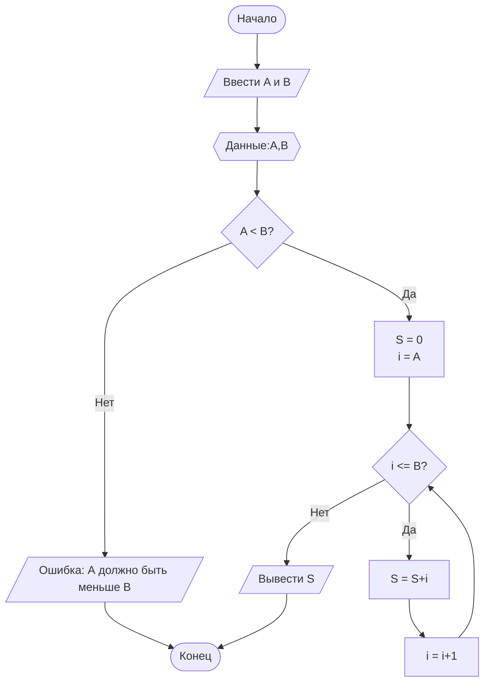

# Задание 1 
Написать Блок-схему "Уборки в доме".
**Условия**: В блок схеме должно быть: 
- не меньше 10 процессов.
- не меньше 5 условий.
- не меньше 1 цикла

## Задание 2 
Написать Блок-схему "Поход в магазин".
**Условия**: В блок схеме должно быть: 
- не меньше 10 процессов.
- не меньше 5 условий.
- не меньше 1 цикла.
- не меньше 1 блока данных.

#### Задание 3.

Написать Блок-схему "Калькулятор".

**Условия**: Калькулятор должен иметь следующие функции:
- Суммирование
- Вычитание
- Умножение
- Деление

#### Вариант 1
Найти сумму всех целых чисел от А до B включительно (Подразумевается ввод А и Б от пользователя)

**Условие**: А < B

*Пояснение*: Нужно использовать цикл для перебора всех чисел от А до B и накопления суммы (Создайте переменную для суммы с помощью блока процесса)

