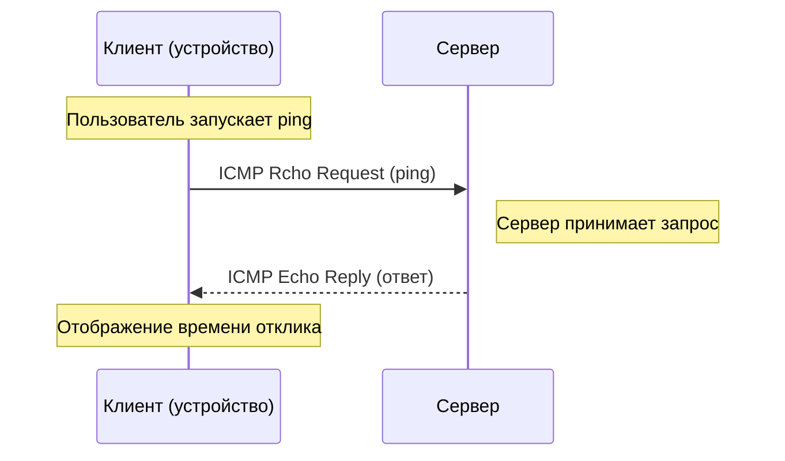
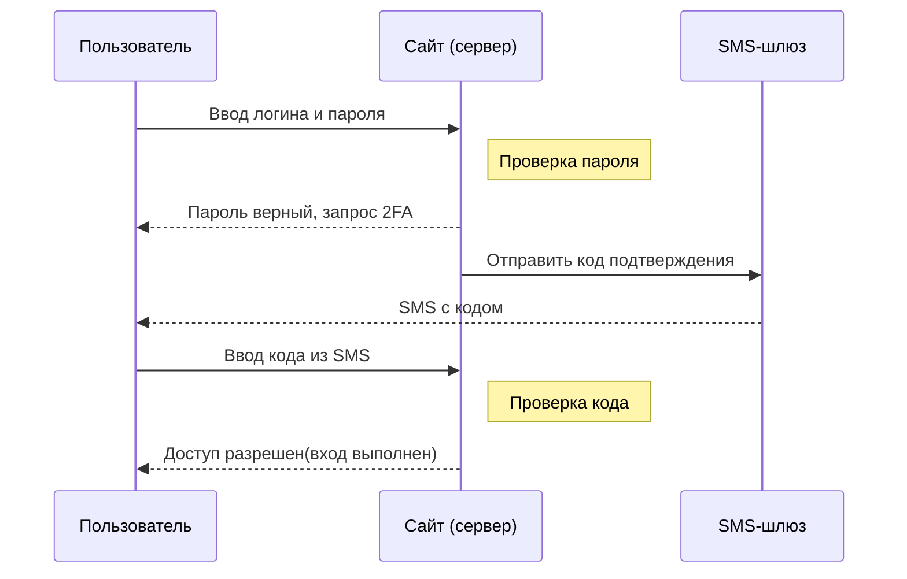
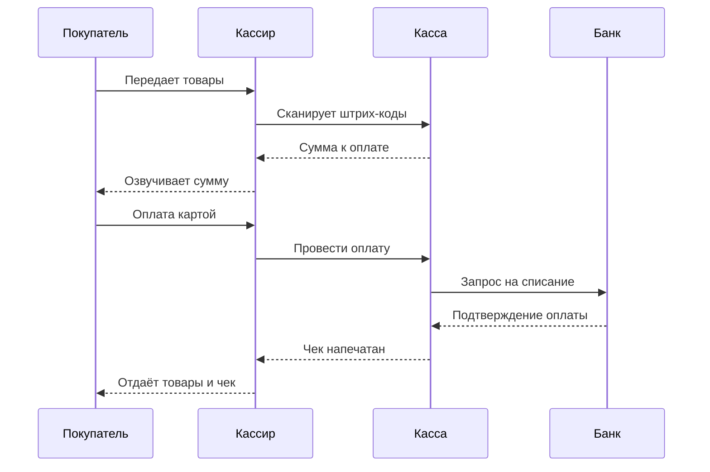

#### Задание 1.

Напишите Sequence-диаграмму отправки ping-запроса на сервер.

**Условия**: В диаграмме должно быть:
- Запрос и ответ от сервера

#### Задание 2.

В теоретической части рассматривался пример авторизации на сайте. Напишите подобную sequence-диаграмму авторизации на сайте, но с двойной аутентификацией.

**Условия**: В диаграмме должно быть:
- Ввод пароля
- Двойная аутентификация (например по смс)

#### Задание 3.

Представьте что вы кассир в Пятерочке. К вам приходит покупатель с покупками. Визуализируйте вашу работу с покупателем и кассой.

**Условия**: 
- Должно быть как минимум 4 объекта
